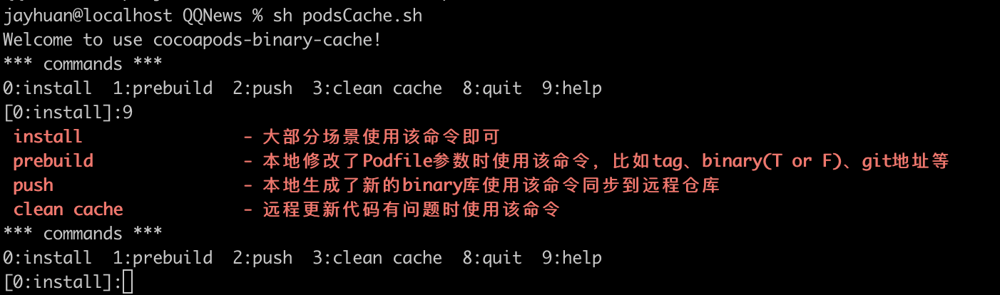

#  pods binary cache

### 1. 背景
共享二进制文件，减少编译时间。

### 2. 插件
[cocoapods-binary-cache](https://github.com/grab/cocoapods-binary-cache)

>  A plugin that helps to reduce the build time of Xcode projects which use CocoaPods by **prebuilding pod frameworks** and **cache them in a remote repository to share across multiple machines**.

- 基于cocoapods，分析互相依赖关系；
- 基于cocoapods-binary，方便执行prebuild。

### 3. Gemfile
类似Podfile，定义了工程所依赖的工具和版本。

- Gemfile 文件格式
```
# frozen_string_literal: true

source "https://rubygems.org"

git_source(:github) {|repo_name| "https://github.com/#{repo_name}" }
gem 'cocoapods', '1.8.4'
gem "cocoapods-binary-cache", '0.1.9'
gem "cocoapods-packing-cubes", '0.4.0'
gem "cocoapods-binary", '0.4.4'

# gem "rails"

```
- 集成
```
gem install bundler 安装bundler工具
bundle init     生成Gemfile
bundle install  安装依赖
```
- 使用
```
bundle exec pod install
```

### 4. cocoapods-binary-cache 使用

- Podfile调整
```
if is_pod_binary_cache_enabled
    plugin 'cocoapods-binary-cache'
    use_frameworks!
    config_cocoapods_binary_cache(
    cache_repo: {
      "default" => {
        "remote" => "https://XXXXXX/BinaryCache.git",
        "local" => "./BinaryCache"
      }
    },
    prebuild_config: "Release",
    dev_pods_enabled: true,
    device_build_enabled:true
  )
else 
  plugin 'cocoapods-binary'
  all_binary!
  use_frameworks!
end

def binary_pod(name, *args)
    if is_pod_binary_cache_enabled
        pod name, args, :binary => true
    else
        pod name, args
    end
end
```

- 开启 binary-cache
```
binary_pod 'BAEngine',             '~> 0.6.0'
```
- 使用源码
```
pod 'BAEngine',             '~> 0.6.0'
```

### 5. 开发使用流程
相关命令都集成在podsCache.sh中


- 正常更新代码
```
sh podsCache.h (回车即可，负责执行pod install)
```

- 遇到问题清理缓存
```
sh podsCache.h (回车）
3   （clean cache，负责清理相关缓存重新pod install）
```

- 修改tag更新本地仓库，或者修改binary => true or false
```
sh podsCache.h (回车）
1   （prebuild，负责重新生成二进制文件，重新pod install）
```
- 如果要同步本地二进制文件到远程仓库
```
sh podsCache.h (回车）
2   （push）
```

### 6. 操作演示
